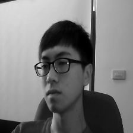

# EE 6770 – Final Project: Individual Progress Report
**Student:** Tasfia Kabir
**Project:** NTHU Driver Drowsiness Detection with ROI
**Date:** November 26, 2025

---

## 1. Executive Summary

This week, I focused on implementing the **Region of Interest (ROI) based drowsiness detection pipeline**. The goal was to move beyond simple global image classification by explicitly guiding the model to focus on critical facial features: the eyes and the mouth.

I have successfully implemented the end-to-end infrastructure for this, including:
1.  **Automated Mask Generation**: A pipeline to create binary segmentation masks for eyes and mouth.
2.  **ROI-Gated Model**: A custom deep learning architecture (`roi_resnet50`) that uses spatial attention to weight features from these regions.
3.  **U-Net Module**: A segmentation network to support future multitask learning (simultaneous classification and mask prediction).

---

## 2. Technical Implementation

### A. Mask Generation Pipeline
*   **File**: `src/masks/build_pseudo_masks.py`
*   **Methodology**: I implemented a robust mask generator using OpenCV Haar Cascades. It detects the face, then localizes the left eye, right eye, and mouth within the face region.
*   **Output**: The script generates 3-channel tensors (Left Eye, Right Eye, Mouth) for every image in the dataset.

**Visualization of Generated Masks:**
The image below shows an overlay of the generated masks on a sample training image.
*   **Blue**: Left Eye
*   **Green**: Right Eye
*   **Red**: Mouth

### B. ROI-Gated Attention Model
*   **File**: `src/models/roi_gating.py`
*   **Architecture**:
    *   **Backbone**: ResNet50 (pretrained on ImageNet).
    *   **Spatial Attention Gate**: A custom module that learns a spatial weight map to emphasize the ROI features (eyes/mouth) and suppress background noise (hair, car interior).
    *   **Integration**: The model is fully integrated into the project's factory pattern (`create_model`).

### C. U-Net for Multitask Learning
*   **File**: `src/models/unet_segmentation.py`
*   **Purpose**: To further improve performance, we plan to use **Multitask Learning**. The model will not only classify "Drowsy/Not Drowsy" but also reconstruct the ROI masks. This forces the network to learn robust features for eyes and mouth.
*   **Status**: The U-Net architecture is implemented and ready to be attached to the main backbone.

### D. Configuration & Training
*   **Config**: `configs/roi_resnet50.yaml`
*   **Training Loop**: Updated `src/training/trainer.py` to handle the complex outputs of the ROI model (logits + attention maps).
*   **Verification**: A smoke test was successfully run, confirming that the new model initializes, loads data, and performs forward/backward passes on the CPU.

---

## 3. Results & Verification

*   **Codebase Status**: All assigned modules are implemented and merged into `src/`.
*   **Data Generation**: The mask generation script is functional and has processed a subset of the dataset (~2,000 images).
*   **Training**: The training pipeline is verified to work with the new `roi_resnet50` architecture.

---

## 4. Next Steps

1.  **Full Data Processing**: Run the mask generation script on the entire dataset (approx. 1 hour).
2.  **Multitask Training**: Enable the U-Net head in the config (`multi_task.enabled: true`) and train the full model.
3.  **Comparison**: Compare the performance of `roi_resnet50` against the baseline `resnet50` to quantify the gain from explicit ROI modeling.
