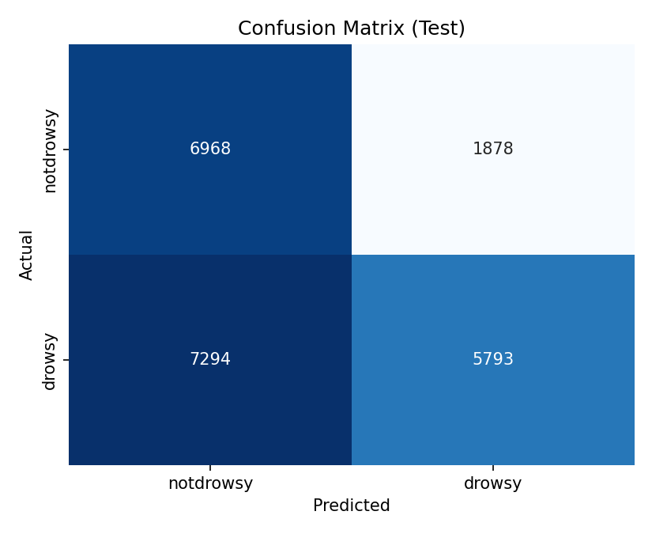
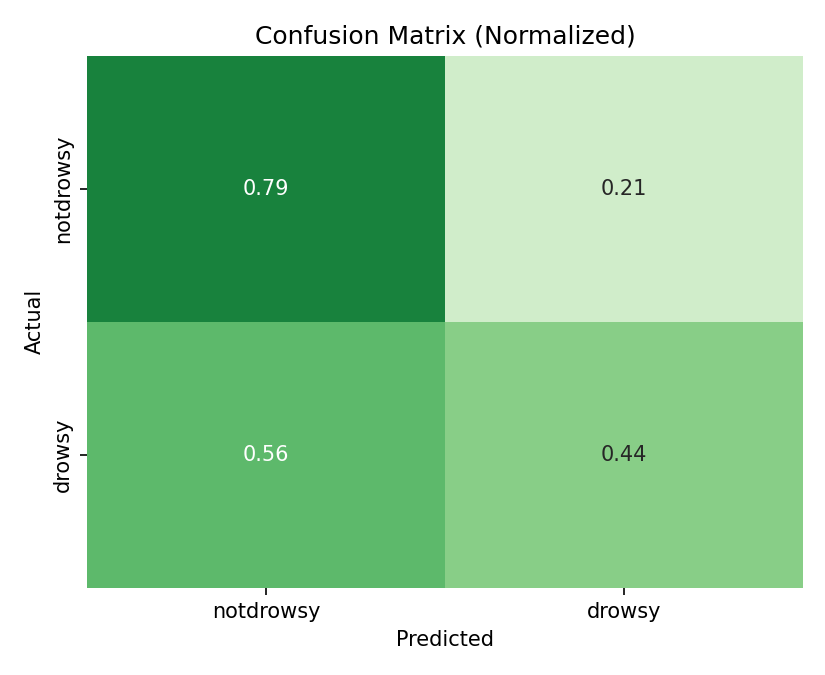

# EE 6770 – Final Project: Individual Progress Report
**Student:** [Your Name]
**Project:** NTHU Driver Drowsiness Detection with ROI
**Date:** November 19, 2025

---

## Part 1: Technical Contribution & Learning (70%)

- **Main Roles:**
  - Data prep validation (subject-exclusive splits under `data/splits/`).
  - Baseline modeling (ResNet50) and training orchestration in Colab.
  - Evaluation tooling (metrics/plots) and experiment reporting.
  - Runtime analysis and mitigation for time-consuming Colab training.

- **Implemented & Tested:**
  - `src/eval/evaluate_model.py` (new CLI):
    - Computes accuracy, macro precision/recall/F1, per-class metrics.
    - Saves confusion matrix CSV and PNGs (raw + normalized), ROC curves (per class) with AUC.
    - Exports `predictions_test.csv` with probabilities per class.
  - Colab workflow (`notebooks/colab_gpu_training.ipynb`) upgrades:
    - Regularized ResNet50 config writer (freeze backbone, dropout 0.7, LR 5e-5, WD 5e-4, patience 5, workers 2).
    - Train/eval/export cells for Regularized ResNet50 and EfficientNet-B0.
    - Comparison cell to plot Accuracy and Macro-F1 across baselines.
    - Speed-up & resume cells: copy dataset to VM SSD, patch `num_workers: 2`.
  - Reports:
    - `docs/training-report-nov18-colab.md`: training status, overfitting analysis, timings, test results, next steps.
    - `docs/report-2025-11-18.md`: daily summary and decision to stop training (time + generalization).

- **Evidence (Code, Models, Figures):**
  - Checkpoints: `checkpoints/baseline_resnet50_best.pth` (epoch 1), `baseline_resnet50_last.pth`.
  - Test (ResNet50 best): Accuracy 0.5818; Macro-F1 0.5806; ROC AUC (macro) 0.6415.
  - Generated figures (copied to `reports/figures/`):
    - `confusion_matrix_test.png`, `confusion_matrix_test_normalized.png`, `roc_curves_test.png`.
  - (If run) `comparison_baselines.png` (Macro-F1 vs Accuracy bar charts).
  - Minimal code snippet (evaluation entry):
```
# src/eval/evaluate_model.py (excerpt)
metrics, cls_report, probs, labels = evaluate(model, test_loader, device=device, save_preds_path=preds_csv)
# Save metrics JSON + AUC
metrics_to_save = {k: (v.tolist() if hasattr(v, "tolist") else v) for k, v in metrics.items()}
metrics_to_save["roc_auc"] = roc_auc_scores
```

- **Challenge & Resolution:**
  - Challenge: Training on Colab became time-consuming with dataset streamed from Google Drive and `num_workers=4` (~5.25 s/iteration mid-epoch), while validation degraded after epoch 1 (classic overfitting).
  - Resolution: Copy dataset to local VM path (`datasets/archive`), reduce `num_workers` to 2, keep `pin_memory: true`. Adopt stronger regularization (freeze backbone, higher dropout, lower LR, higher WD) and add a lighter baseline (EfficientNet-B0) for faster epochs and better generalization.

### Overfitting Analysis

| Epoch | Train Loss | Train Macro-F1 | Val Loss | Val Macro-F1 | Notes |
|-------|-----------:|---------------:|---------:|-------------:|-------|
| 1     | 0.2207     | 0.9071         | 0.8263   | **0.5772**    | Best validation; checkpoint saved |
| 2     | 0.1218     | 0.9524         | 1.2085   | 0.4987        | Validation performance drops sharply |
| 3     | 0.1012     | 0.9602         | 1.4190   | 0.4782        | Further decline; overfitting intensifies |

Pattern: Training metrics improve (loss ↓, F1 ↑) while validation loss increases and Macro-F1 decreases after epoch 1. This divergence indicates memorization of training samples rather than generalizable features.

Mitigation steps now in place: backbone freezing, increased dropout, stronger weight decay, lower learning rate, early stopping patience reduction, lighter alternative architecture (EfficientNet-B0), and improved data loading throughput (local copy + fewer workers).

**Challenge: Training Time (Bold)** – In addition to overfitting, the throughput slowdown (≈5.25 s/iteration mid-epoch when reading from Drive with 4 workers) inflated epoch duration, making rapid experimentation impractical until mitigations (local copy, fewer workers) were applied.

---

## Part 2: Plan to Complete Before Final Presentation

- Near-term experiments (this week):
  - Train Regularized ResNet50 (Colab, local dataset copy, 2 workers); evaluate and export artifacts.
  - Train EfficientNet-B0; evaluate; run comparison plots (`reports/figures/comparison_baselines.png`).
- ROI phase: Train ROI-gated approach (`src/models/roi_gating.py`, `unet_segmentation.py`) focusing on eyes/mouth.
- Reporting: Consolidate metrics/plots, per-class breakdowns; finalize slides.
- Practical Colab steps:
  - Copy dataset to `/content/nthu-driver-drowsiness-ROI/datasets/archive`, patch `num_workers: 2`, run `--device cuda`.
- Milestones:
  - Week 1 (Nov 19–24): Complete regularized + EfficientNet runs and comparisons.
  - Week 2: ROI training/evaluation; finalize analysis and slides.

---

## Project Snapshot

- Key configs: `configs/baseline_resnet50.yaml`, `configs/baseline_resnet50_regularized.yaml`, `configs/baseline_efficientnet.yaml`.
- Relevant code: `src/training/train_baseline.py`, `src/training/trainer.py`, `src/data/dataset.py`, `src/data/transforms.py`, `src/eval/evaluate_model.py`.
- Notebook: `notebooks/colab_gpu_training.ipynb` (GPU setup → train → evaluate → export → compare → speed-up/resume).
- Figures: under `reports/figures/` (confusion matrices, ROC, comparison).

---

## Colab Time Consumption (GPU) – Findings

- Baseline reference: ~74 minutes for epoch 1 (train ~42m + val ~32m).
- With Drive I/O + 4 workers: ~5.25 s/iteration mid-epoch; epochs elongated and inconsistent.
- Mitigations: use 2 workers, local dataset copy, regularized setup, or EfficientNet-B0.

### Detailed Training Time Breakdown (ResNet50 Baseline)

| Phase / Epoch | Train Duration | Val Duration | Notes |
|---------------|---------------:|-------------:|-------|
| Epoch 1       | ~42 min        | ~32 min      | Includes initial model + caching overhead |
| Epoch 2       | ~5 min         | ~2.3 min     | After caching; faster I/O |
| Epoch 3       | ~5 min (train) | ~2.4 min     | Validation degraded; overfitting intensified |
| Drive-I/O worst case (observed mid-epoch) | >70 min (projected) | >30 min (projected) | When streaming directly from Drive with 4 workers and contention |

**Observation:** After the first epoch warms caches, training becomes much faster if data access is stable. However, reading via Google Drive with high worker count can revert to slow per-iteration times (~5.25s/it). Copying the dataset locally plus reducing workers stabilizes throughput.

### Test Set Results (Best Checkpoint – Epoch 1)

| Metric            | Value |
|-------------------|------:|
| Accuracy          | 0.5818 |
| Macro Precision   | 0.6219 |
| Macro Recall      | 0.6152 |
| Macro F1          | 0.5806 |
| ROC AUC (macro)   | 0.6415 |

Per-Class Detail:

| Class      | Precision | Recall | F1     | Support |
|------------|----------:|-------:|-------:|--------:|
| notdrowsy  | 0.4886    | 0.7877 | 0.6031 |  8,846 |
| drowsy     | 0.7552    | 0.4427 | 0.5581 | 13,087 |

**Interpretation:** Model favors higher recall for notdrowsy and higher precision for drowsy, indicating a conservative drowsy classification (missed positives) under current training regime.

### Figure References




<!-- Optional baseline comparison if generated -->
<!--  -->

---

## Export to PDF (Options)

- VS Code: Open this file and use “Markdown: Print to PDF” (or the Markdown PDF extension).
- Pandoc (if installed):
```powershell
pandoc docs/individual-progress-report.md -o docs/individual-progress-report.pdf
```
