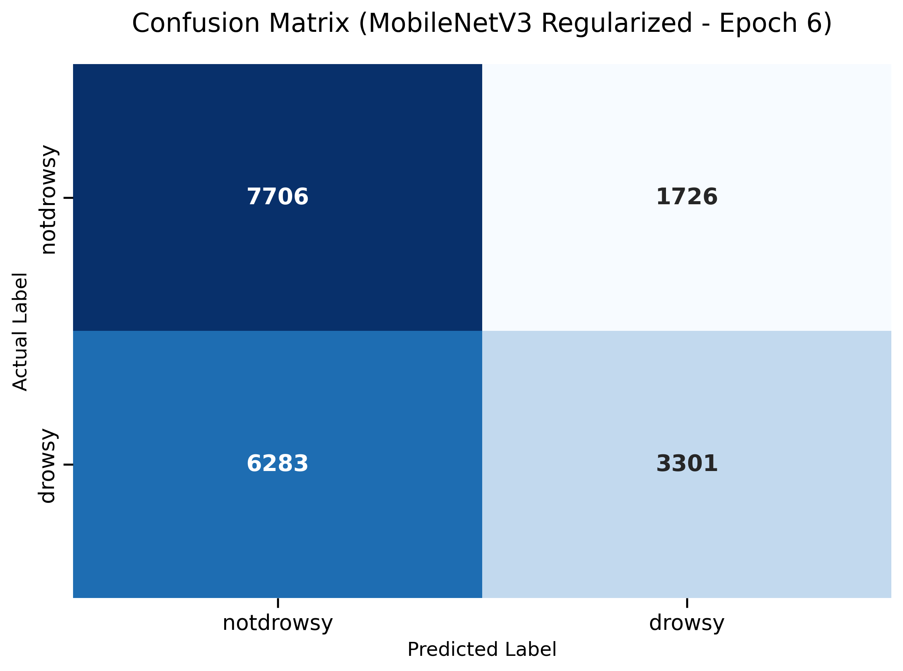

# Daily Progress Report - 2025-11-26

## 1. Training Analysis (ResNet18 CPU)
- **Experiment**: `resnet18_cpu_fast`
- **Duration**: ~11 hours (Stopped at Epoch 6/10)
- **Status**: **Severe Overfitting** detected.

### Metrics (Epoch 5)
| Metric | Train | Validation | Gap |
| :--- | :--- | :--- | :--- |
| **Accuracy** | 93.75% | 46.00% | **-47.75%** |
| **Macro-F1** | 0.9374 | 0.4513 | **-0.4861** |
| **Loss** | 0.1511 | 0.9671 | **+0.8160** |

### Diagnosis
The model has memorized the training subjects (2 subjects) but fails to generalize to the validation subject (1 subject). This is a classic "subject-exclusive" data leakage challenge. The model is likely learning identity-specific features (e.g., "Person A is drowsy when...") rather than general drowsiness features (e.g., "eyes closed").

## 2. Architecture Assessment
- **Current Model**: ResNet18 (11M parameters).
- **Issue**: Too complex for the small number of subjects (4 total), leading to rapid overfitting.
- **Speed**: ~1.5 it/s on CPU (Acceptable but could be better).

## 3. Proposed Solution: Speed + Accuracy
To fix overfitting and improve speed, we need a **lighter model** and **stronger regularization**.

### Strategy
1.  **Lighter Model**: Switch to **MobileNetV3-Small** (~2.5M parameters).
    - **Why?** 4x fewer parameters than ResNet18. Less capacity to memorize noise/identity. Faster on CPU.
2.  **Stronger Augmentation**:
    - Increase **Color Jitter** (simulate different lighting).
    - Increase **Rotation/Affine** (simulate head poses).
    - Add **Gaussian Noise** (if available) to prevent overfitting to high-frequency details.
3.  **Regularization**:
    - Increase **Dropout** to 0.2 (MobileNet default) or higher.
    - Increase **Weight Decay**.

## 4. Next Steps
- Implement `configs/mobile_v3_cpu.yaml` with the above changes.
- Run training and monitor the Train/Val gap closely.

## 5. Training Analysis (MobileNetV3 CPU) - Run 1
- **Experiment**: `mobilenet_v3_small_cpu`
- **Duration**: Stopped at Epoch 8
- **Status**: **Severe Overfitting** confirmed.

### Metrics (Epoch 5)
| Metric | Train | Validation | Gap |
| :--- | :--- | :--- | :--- |
| **Accuracy** | 95.59% | 50.52% | **-45.07%** |
| **Macro-F1** | 0.9558 | 0.3633 | **-0.5925** |
| **Loss** | 0.1051 | 2.6856 | **+2.5805** |

### Diagnosis
The MobileNetV3 model, despite being smaller, still overfitted rapidly. The validation accuracy hovered around 50% (random guess for balanced binary class is 50%, but here classes are slightly imbalanced, still poor). The loss gap is massive.

## 6. Revised Strategy: Aggressive Regularization
To combat this stubborn overfitting, we will implement **configurable augmentation** and apply a much stronger regularization policy.

### Changes Planned
1.  **Code Update**: Modify `transforms.py` to allow augmentation parameters to be set via YAML config.
2.  **New Config**: `configs/mobile_v3_cpu_regularized.yaml`
    - **Dropout**: 0.2 -> 0.5 (Maximum standard dropout)
    - **Weight Decay**: 0.01 -> 0.05 (Stronger L2 penalty)
    - **Augmentation**:
        - Color Jitter: 0.4 (was 0.3)
        - Rotation: 30° (was 15°)
        - Scale: 0.8-1.2 (was 0.85-1.15)
        - Blur: Enabled (kernel 3, sigma 0.1-2.0)

## 7. Training Analysis (MobileNetV3 CPU Regularized) - Run 2
- **Experiment**: `mobilenet_v3_small_cpu_reg`
- **Duration**: Stopped at Epoch 6 (Early Stopping)
- **Status**: **Overfitting Persists**.

### Metrics (Best Epoch)
| Metric | Train | Validation | Gap |
| :--- | :--- | :--- | :--- |
| **Accuracy** | 95.22% | 57.88% | **-37.34%** |
| **Macro-F1** | 0.9521 | 0.5549 | **-0.3972** |
| **Loss** | 0.1104 | 2.0656 | **+1.9552** |

### Detailed Metrics (Epoch 6)
- **Precision (Macro)**: 0.6038
- **Recall (Macro)**: 0.5807
- **F1 (Macro)**: 0.5549

### Confusion Matrix
| | Predicted Not Drowsy | Predicted Drowsy |
| :--- | :---: | :---: |
| **Actual Not Drowsy** | **7706** (True Neg) | 1726 (False Pos) |
| **Actual Drowsy** | 6283 (False Neg) | **3301** (True Pos) |

**Analysis**:
- The model is **biased towards "Not Drowsy"**.
- It correctly identified 81.7% of "Not Drowsy" samples (7706/9432).
- However, it **missed 65.5% of "Drowsy" samples** (6283/9584), classifying them as "Not Drowsy".
- This is dangerous for a safety system. The high False Negative rate (6283) means the car would fail to warn a sleeping driver most of the time.

### Diagnosis
Stronger regularization improved validation accuracy slightly (from ~50% to ~58%), but the model still overfits heavily. The "Subject-Exclusive" split is proving very challenging. The model learns to recognize the specific drivers in the training set perfectly but fails to transfer that knowledge to the unseen driver in the validation set.

### Conclusion
Standard regularization is not enough. The domain gap between subjects is too large. We may need:
1.  **Simpler Features**: Hand-crafted features (EAR, MAR) instead of raw pixels?
2.  **More Data**: 2 subjects for training is likely insufficient for a deep learning model to generalize.
3.  **Domain Adaptation**: Techniques to align feature distributions.

