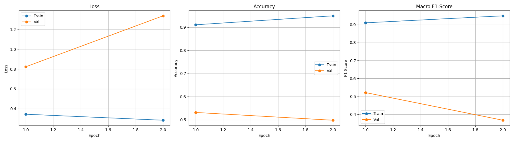

# Daily Report - 2025-12-03
## Optimization & Overfitting Analysis

### 1. Achievements
- **Speed Optimization**: Successfully implemented `MobileNetV3-Large` with `persistent_workers` and `prefetching`.
- **Performance**: Training speed improved significantly (~1.5s/it on local CPU/GPU).
- **Bug Fixes**: Resolved Windows `torch.compile` compatibility and `metrics.py` IndexError.

### 2. The Problem: Overfitting
During the latest training run, we observed a critical issue:
- **Training Accuracy**: ~95% (Model memorized the data)
- **Validation Accuracy**: ~50% (Model failed to generalize)

**Root Cause**:
The dataset uses a **Subject-Exclusive Split** (e.g., Train on Subjects A,B; Validate on Subject C). The model is learning to recognize the **identity** of the training subjects (face shape, glasses, background) rather than the **drowsiness features** (closed eyes, yawning). This is a common "shortcut learning" problem in small-subject datasets.

### 3. Comprehensive Action Plan (Prevention Strategy)

To force the model to learn *drowsiness* and not *identity*, we will implement the following strategies:

#### A. Data Augmentation (Aggressive)
We need to destroy identity information while preserving drowsiness cues.
- **Random Resized Crop**: Force the model to look at local features (just an eye, just the mouth) rather than the whole face.
- **Strong Color Jitter**: Remove reliance on specific skin tones or lighting conditions.
- **Grayscale**: Randomly convert images to grayscale to remove color dependency entirely.
- **Gaussian Blur**: Prevent reliance on high-frequency texture details (pores, specific skin texture).

#### B. Regularization
- **Dropout**: Increase from `0.2` to `0.5` or `0.6` in the classifier head.
- **Weight Decay**: Increase from `0.01` to `0.05` to penalize large weights.
- **Label Smoothing**: Increase from `0.1` to `0.2` to prevent the model from being "too confident" about specific subjects.

#### C. ROI-Based Approach (The "ROI" in Project Name)
The most effective way to remove identity is to **not show the face**.
- **Crop Eyes & Mouth**: Use a face detector (or existing landmarks if available) to crop *only* the eyes and mouth regions.
- **Multi-Stream Network**: Train a model that takes (Left Eye, Right Eye, Mouth) as inputs. This explicitly removes forehead, hair, and background identity cues.

#### D. Training Strategy
- **Early Stopping**: Keep strict patience (5 epochs) to stop before memorization sets in.
- **Freeze Backbone**: Freeze the pre-trained feature extractor and only train the classifier head for the first few epochs. This preserves the generic ImageNet features before they get corrupted by subject-specific overfitting.

### 4. Next Steps
1.  Modify `configs/fast_training.yaml` to enable **stronger augmentation**.
2.  Update `src/data/transforms.py` to support these new augmentations.
3.  (Optional) Investigate implementing the **ROI cropping** pipeline if augmentation alone is insufficient.
