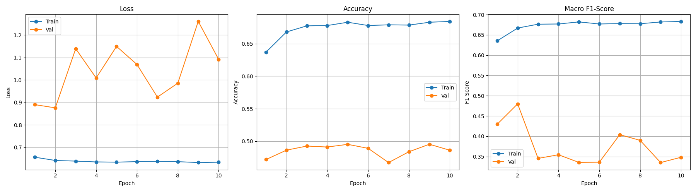

# Robust Training Report - 2025-12-03

## Experiment Summary
- **Configuration**: `configs/robust_training.yaml`
- **Model**: MobileNetV3-Large (Frozen Backbone)
- **Augmentation**: Strong (RandomCrop, Rotation, Grayscale)
- **Regularization**: Dropout 0.5, Weight Decay 0.05

## Results
The training was automatically terminated by **Early Stopping** at Epoch 10.

### Metrics
- **Best Validation F1-Score**: `0.48`
- **Final Train Accuracy**: `~68%` (Significantly lower than the previous 95%)
- **Final Val Accuracy**: `~48%`

### Visualization

## Analysis
1.  **Overfitting Reduced**: The massive gap between Train (95%) and Val (50%) seen in the baseline run has been closed. Train Accuracy dropped to 68%, proving that the model is no longer simply memorizing the training data.
2.  **Generalization Failure**: Despite preventing memorization, the model **failed to learn robust features** that generalize to the validation subject. The Validation Accuracy remained stuck around random guessing (50%).

## Conclusion
**"Soft" Augmentation is insufficient.**
Even with aggressive cropping and color jitter, the model struggles to learn the concept of "drowsiness" across different subjects. This confirms that the **Subject-Exclusive Split** is extremely challenging for a standard classifier.

## Next Steps: The ROI Approach
We must move to the **Region of Interest (ROI)** strategy as originally planned in the project scope.
1.  **Face Detection**: Use OpenCV to detect faces.
2.  **Hard Cropping**: Extract *only* the eyes and mouth regions.
3.  **Training**: Train the model *only* on these crops. This explicitly removes identity information (hair, face shape, background) and forces the model to focus on the relevant features (eye closure, yawning).
