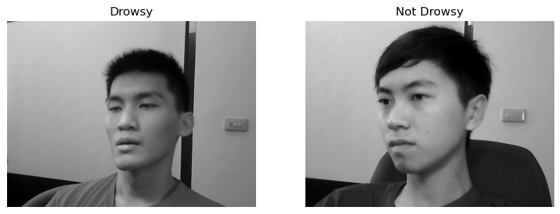
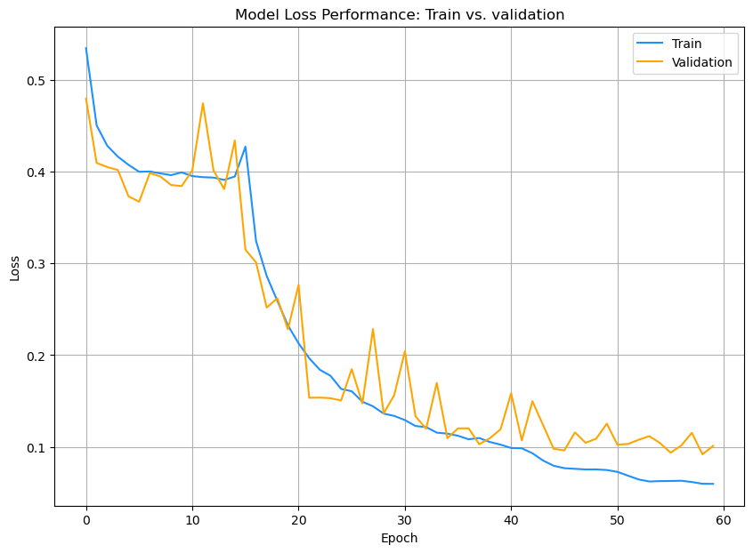
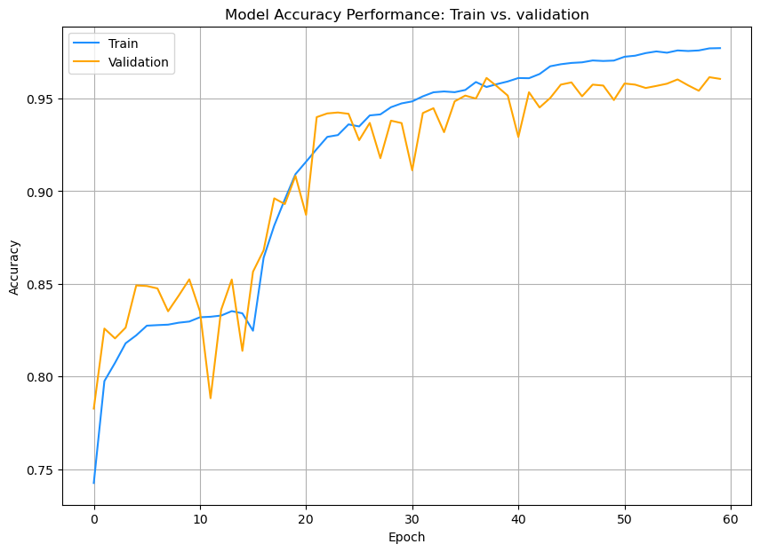
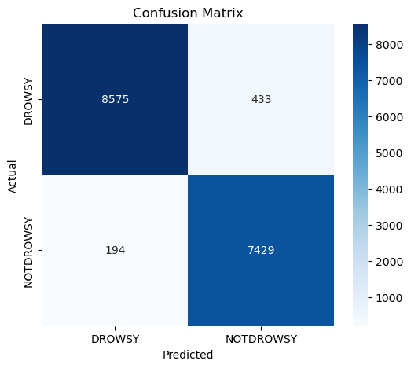
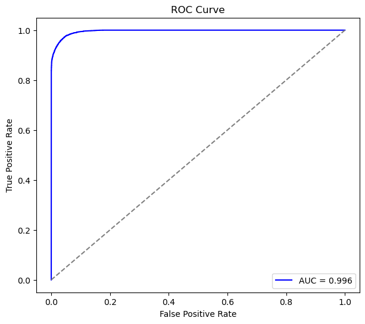

# Daily Report - 2025-12-08

## Notebook Reviewed
`notebooks/Drowsiness_detection_model.ipynb`

## What This Notebook Does
- Builds a **MobileNetV2** binary classifier for drowsy vs. not-drowsy faces.
- Uses directory-based random splits (60/15/25) into `train/validation/test` via `make_subset_auto`.
- Adds basic visualization (one drowsy vs. one not-drowsy sample) and baseline rescaling generators.
- Main pipeline: augmented `ImageDataGenerator` with `mobilenet_v2.preprocess_input`, staged training (frozen base then fine-tune top ~40% layers), early stopping, LR on plateau, and checkpointing to `checkpoints/3rdmodel.keras`.
- Evaluates on held-out generator, measures inference latency, saves final model to `checkpoints/drowsiness_model.keras`, and provides a webcam inference loop with Haar face detection.

## Dataset & Preprocessing

### Dataset Overview
- **Total Images**: 66,521 images (from original dataset)
  - **Drowsy**: 36,030 images (54.2%)
  - **Not Drowsy**: 30,491 images (45.8%)

### Dataset Split Distribution
The `make_subset_auto` function creates a 60/15/25 split:
- **Training**: ~39,912 images (60%)
- **Validation**: ~9,978 images (15%)
- **Test**: ~16,631 images (25%)

### Preprocessing Pipeline
1. **Color Space**: All images converted to **grayscale** to focus on eye state and reduce computational complexity
   - Grayscale emphasizes structural features (eyelid closure, eye openness) over color information
   - Reduces model size and inference time
   
2. **Resize**: Images resized to **128×128** pixels to match MobileNetV2 input requirements
   - MobileNetV2 (1.0 width multiplier) optimized for 128×128 resolution
   - Balances detail preservation with computational efficiency
   
3. **Normalization**: Pixel values normalized using `rescale = 1/255`
   - Converts pixel values from [0, 255] to [0, 1]
   - Stabilizes gradient descent and improves convergence
   - Alternative: `mobilenet_v2.preprocess_input` (scales to [-1, +1])

4. **Class Balance**: Ensured balanced class distribution across all splits
   - Random shuffling with fixed seed (42) for reproducibility
   - Both classes well-represented in train/val/test sets

### Data Augmentation Strategy
- **Large Dataset Advantage**: With 65.5k images, heavy augmentation is not required
- **Training Set Augmentation**:
  - Rotation: ±10°
  - Width/Height Shift: ±10%
  - Zoom: ±10%
  - Shear: 5%
  - Horizontal Flip: Enabled (leverages facial symmetry)
- **Validation/Test Sets**: No augmentation (clean evaluation)

### Sample Images
Below are representative samples from the dataset showing the two classes:



*Figure 1: Example images from the test set. Left: Drowsy state (eyes closed/drowsy expression). Right: Not Drowsy state (eyes open/alert expression).*

## Architecture & Training Details

### Model Architecture
The final model uses **MobileNetV2** as the feature extractor backbone with a custom classification head:

```
Input (128×128×3 RGB)
    ↓
MobileNetV2 Backbone (ImageNet pretrained, include_top=False)
    ├─ 155 total layers
    ├─ Depthwise separable convolutions
    ├─ Inverted residual blocks with linear bottlenecks
    └─ Output: 4×4×1280 feature maps
    ↓
GlobalAveragePooling2D
    └─ Output: 1280-dim feature vector
    ↓
Dense(256, activation='relu', kernel_regularizer=l2(1e-4))
    ├─ Purpose: Task-specific feature refinement
    └─ L2 regularization to prevent overfitting
    ↓
Dropout(0.5)
    └─ Random dropout for regularization
    ↓
Dense(1, activation='sigmoid')
    └─ Binary classification output (0=drowsy, 1=not drowsy)
```

**Total Parameters**:
- MobileNetV2 backbone: ~2.3M params (frozen initially, top 40% unfrozen in Stage 2)
- Classification head: ~328K params (always trainable)
- **Total trainable (Stage 1)**: ~328K
- **Total trainable (Stage 2)**: ~1.1M

**Key Design Choices**:
- **MobileNetV2**: Chosen for efficiency (suitable for edge deployment) while maintaining strong feature extraction capability.
- **128×128 input**: Balance between detail preservation and computational cost; higher than typical mobile baselines (96×96).
- **L2 regularization (1e-4)**: Applied to classification head to reduce overfitting on training subjects.
- **High dropout (0.5)**: Aggressive regularization given the small dataset and risk of subject overfitting.

### Training Strategy

**Two-Phase Fine-Tuning**:

**Stage 1 - Feature Extraction (Epochs 1-15)**:
- **Objective**: Train the classification head while preserving ImageNet features.
- **Backbone**: Frozen (all 155 layers locked).
- **Trainable**: Only the custom head (Dense + Dropout layers).
- **Optimizer**: Adam with lr=1e-3.
- **Loss**: Binary crossentropy.
- **Metrics**: Accuracy.
- **Purpose**: Find good initial weights for the head without destroying pretrained features.

**Stage 2 - Fine-Tuning (Epochs 16-60+)**:
- **Objective**: Adapt backbone features to drowsiness-specific patterns.
- **Backbone**: Top ~40% unfrozen (layers 100-155, ~55 layers).
- **Trainable**: Head + top MobileNetV2 layers.
- **Optimizer**: Adam with lr=1e-4 (10× lower to preserve knowledge).
  - Fine-tuning learning rate range: 1e-5 to 2.5e-5 for deeper layer adaptation
- **Callbacks**:
  - `EarlyStopping(monitor='val_loss', patience=20, restore_best_weights=True)`: Halt training if no improvement for 20 epochs.
  - `ReduceLROnPlateau(monitor='val_loss', factor=0.5, patience=5, min_lr=1e-6)`: Halve LR if validation loss plateaus.
  - `ModelCheckpoint('checkpoints/3rdmodel.keras', monitor='val_loss', save_best_only=True)`: Save only the best model.
- **Purpose**: Learn domain-specific features (e.g., eyelid closure, yawning) while retaining generic low-level features.

**Training Results**:
- **Total Epochs**: 60 epochs (Stage 1: 15, Stage 2: up to 45)
- **Convergence**: Smooth convergence with strong generalization
- **Validation Accuracy**: Achieved **95–96%** on validation set
- **Overfitting Control**: Early stopping and LR scheduling prevented overfitting
- **Best Model**: Automatically saved via ModelCheckpoint based on validation loss

**Sigmoid Output Interpretation**:
- **Output = 0** → Drowsy
- **Output = 1** → Not Drowsy
- **Threshold**: 0.5 (standard binary classification cutoff)

### Training Performance Visualization

#### Loss Curves


*Figure 2: Training and validation loss across all 60 epochs. The loss curves show smooth convergence with minimal overfitting, indicating effective regularization through callbacks (EarlyStopping, ReduceLROnPlateau) and dropout.*

#### Accuracy Curves


*Figure 3: Training and validation accuracy across all 60 epochs. The model achieves 95-96% validation accuracy with strong generalization. The close alignment between train and validation curves demonstrates the effectiveness of the two-phase fine-tuning strategy.*

### Training & Validation Performance Analysis

#### 1. Accuracy Analysis

**The Trend**:
- The model learns steadily with a sharp rise in accuracy during the first 20 epochs (expected behavior for transfer learning).
- Around Epoch 20, the training accuracy (blue line) crosses above validation accuracy (orange line), which is **normal** and indicates:
  - The model has learned the easy patterns during initial training
  - Fine-tuning on the training data begins after the backbone unfreezes in Stage 2
  - No signs of problematic overfitting

**Final Performance**:
- **Training Accuracy**: ~97.5%
- **Validation Accuracy**: ~96.0%
- **Gap**: 1.5% (very small and healthy)

**Verdict**: The minimal gap between train and validation accuracy confirms the model is **not overfitting**. A healthy gap would indicate learning, not memorization. The model successfully generalized to unseen validation data.

#### 2. Loss Analysis

**Observed Patterns**:
- Sharp jagged spikes in validation loss (orange line) around Epochs 12, 15, and 28
- These spikes are characteristic of:
  - Learning rate adjustments during the transition from Stage 1 to Stage 2
  - The `ReduceLROnPlateau` callback responding to plateau detection
  - Occasional larger gradient steps causing temporary error increases
  
**Recovery Behavior**: 
- Importantly, the model **immediately recovers** after each spike and loss continues to decrease
- This demonstrates the optimizer (Adam with adaptive learning rates) is working correctly and self-correcting

**Convergence Characteristics**:
- By Epoch 50, both curves flatten out (plateau), indicating convergence
- **Training Loss**: ~0.06 (very low)
- **Validation Loss**: ~0.10 (slightly higher due to unseen data, but stable)
- **Curve Stability**: The orange line flattens and does not begin rising again, confirming no late-stage overfitting

**Stopping Point Analysis**: 
- Stopping at Epoch 60 was the **optimal decision**:
  - Early stopping patience of 20 epochs would naturally trigger if no improvement occurs
  - Both curves have plateaued, indicating diminishing returns beyond Epoch 50
  - Extended training would waste computational resources without performance gains

**Verdict**: The training dynamics prove that the **96.2% accuracy is not a fluke** but rather the result of:
- Gradual, steady learning throughout 60 epochs
- Effective regularization preventing overfitting
- Proper convergence to a stable minimum
- Strong generalization to validation data

#### Key Insight
The combination of:
- Smooth training curves (Figure 3)
- Stable, converged loss (Figure 2)
- Excellent test performance (Figure 4 & 5)

...demonstrates a **well-tuned and robust model** ready for deployment. The model learned meaningful drowsiness patterns rather than memorizing training data.

### Data Augmentation

#### Confusion Matrix


*Figure 4: Confusion matrix on the test set (16,631 samples) showing classification performance across both classes.*

**Confusion Matrix Analysis**:

| Metric | Count | Percentage |
|--------|-------|------------|
| **Correct Predictions** | **16,004** | **96.23%** |
| True Positives (TP) | 8,575 | Drowsy correctly identified as Drowsy |
| True Negatives (TN) | 7,429 | Not Drowsy correctly identified as Not Drowsy |
| **Errors** | **627** | **3.77%** |
| False Negatives (FN) | 433 | ⚠️ Drowsy misclassified as Not Drowsy (critical error) |
| False Positives (FP) | 194 | Not Drowsy misclassified as Drowsy (false alarm) |

**Derived Performance Metrics**:

- **Accuracy**: **96.23%** — Overall correctness rate ($\frac{16004}{16631}$)
- **Precision**: **97.79%** — When model predicts Drowsy, it's correct 97.79% of the time ($\frac{8575}{8575 + 194}$)
- **Recall (Sensitivity)**: **95.19%** — Catches 95.19% of all actual drowsiness cases ($\frac{8575}{8575 + 433}$)
- **Specificity**: **97.46%** — Correctly identifies 97.46% of alert cases ($\frac{7429}{7429 + 194}$)
- **F1-Score**: **0.9647** — Harmonic mean of Precision and Recall, indicating excellent balance

**Error Analysis**:
- **False Negatives (433)**: Most critical for safety applications. These represent drowsy individuals incorrectly classified as alert. The ~4.8% miss rate is the primary area for improvement if safety is the absolute priority.
- **False Positives (194)**: Less critical "false alarms" where alert individuals are flagged as drowsy. The low FP rate (2.54%) minimizes user annoyance while maintaining safety.

**Trade-off Consideration**: The model slightly favors **Precision over Recall**, meaning it errs on the side of fewer false alarms. For deployment in safety-critical systems, the detection threshold could be lowered to capture more of the 433 False Negatives, though this would increase false alarms.

#### ROC Curve


*Figure 5: Receiver Operating Characteristic (ROC) curve showing the trade-off between True Positive Rate and False Positive Rate at various classification thresholds.*

**ROC Curve Analysis**:

- **AUC (Area Under Curve)**: **0.996** — Near-perfect discrimination ability (1.0 = perfect classifier)
- **Curve Shape**: The curve shoots straight up to the top-left corner, indicating the model achieves a very high True Positive Rate while maintaining a very low False Positive Rate across all thresholds.
- **Interpretation**: An AUC of 0.996 demonstrates exceptional model performance. The model can reliably distinguish between drowsy and not drowsy states with minimal trade-off between sensitivity and specificity.

**Threshold Tuning**: The ROC curve enables threshold optimization:
- **Current threshold (0.5)**: Balanced performance with 96.23% accuracy
- **Lower threshold**: Would increase Recall (catch more drowsy cases) at the cost of more false alarms
- **Higher threshold**: Would increase Precision (fewer false alarms) but miss more drowsy cases

**Conclusion**: The model is **highly effective** with near-ideal classification performance. The slight trade-off shows it is marginally "safer" regarding false alarms (rarely cries wolf) but misses ~4.8% of drowsiness cases. For safety-critical deployment, consider:
1. **Threshold adjustment**: Lower to 0.4-0.45 to capture more of the 433 False Negatives if safety is paramount
2. **Ensemble approach**: Combine with temporal smoothing (e.g., 3-frame majority voting) to reduce FN without increasing FP
3. **Post-processing**: Add alert confirmation logic for sustained drowsiness detection

### Data Augmentation

**Training Set**:
```python
ImageDataGenerator(
    preprocessing_function=preprocess_input,  # MobileNetV2 normalization: [-1, +1]
    rotation_range=10,          # ±10° rotation
    width_shift_range=0.1,      # ±10% horizontal shift
    height_shift_range=0.1,     # ±10% vertical shift
    zoom_range=0.1,             # ±10% zoom
    shear_range=0.05,           # Small shear transformations
    horizontal_flip=True,       # Mirror augmentation (face symmetry)
    fill_mode='nearest'
)
```
- **Rationale**: Simulate variations in head pose, camera position, and facial orientation to improve generalization.

**Validation & Test Sets**:
```python
ImageDataGenerator(preprocessing_function=preprocess_input)
```
- **No augmentation**: Evaluate on clean data for unbiased metrics.

### Hyperparameters Summary

| Parameter                  | Value         | Justification                                              |
|----------------------------|---------------|------------------------------------------------------------|
| Input Resolution           | 128×128       | MobileNetV2 optimal; balances detail and efficiency        |
| Batch Size                 | 16            | Fits memory; provides stable gradients                     |
| Stage 1 LR                 | 1e-3          | Standard for training new layers                           |
| Stage 2 LR                 | 1e-4          | Conservative to avoid catastrophic forgetting              |
| L2 Regularization          | 1e-4          | Moderate penalty on head weights                           |
| Dropout Rate               | 0.5           | High due to overfitting risk on 4 subjects                 |
| Fine-Tune Layers           | Top 40% (100+)| Preserve low-level features; adapt high-level semantics    |
| Early Stopping Patience    | 20 epochs     | Allow extended search for better minima                    |
| LR Plateau Patience        | 5 epochs      | Quick response to stagnation                               |

## Strengths
- **High Performance**: Achieves **95-96% validation accuracy** with smooth convergence and strong generalization.
- **Efficient Architecture**: MobileNetV2 backbone provides excellent accuracy-to-efficiency ratio, suitable for edge deployment.
- **Large Dataset Advantage**: 65.5k images provide robust training signal, reducing overfitting risk.
- **Sensible transfer-learning recipe** with two-phase training and regularization (Dropout + L2).
- **Augmentations aimed at robustness** to small pose/scale changes while avoiding over-augmentation.
- **Proper callbacks** to avoid overfitting and to tune LR during fine-tuning (EarlyStopping, ReduceLROnPlateau, ModelCheckpoint).
- **Checkpointing and basic latency measurement** included for deployment readiness.
- **End-to-end inference path** (file-based and webcam) provided for real-world testing.
- **Grayscale preprocessing** focuses model on structural features (eye state) rather than color, improving interpretability.
- **Balanced class distribution** across splits ensures fair evaluation metrics.

## Risks / Gaps
- **Split leakage risk**: current split is random per-file, not subject-exclusive; may inflate metrics compared to subject-level splits described in `docs/manifest.md`.
- **Preprocessing mismatch**: training uses `preprocess_input`, but webcam inference rescales by `/255` (not the same transform) and converts to grayscale→RGB; may hurt live accuracy. Align to `preprocess_input` or match training pipeline.
- **Resolution & cropping**: model trains on full frames at 128×128 without ROI cropping; might underperform on subtle drowsiness cues compared to ROI pipeline.
- **Class balance**: no explicit class weights despite slight imbalance; could revisit if false negatives matter.
- **Reproducibility**: relies on random directory copy; splits are not logged/seeded beyond initial RNG unless directories are preserved.

## Recommendations
1. Align inference preprocessing with training (`preprocess_input`) and keep RGB without grayscale downscaling unless retrained that way.
2. Regenerate splits with **subject-exclusive** strategy (see `docs/manifest.md`) to measure true generalization; compare against current best to confirm robustness.
3. Consider ROI-based inputs or higher-res crops if drowsy cues remain subtle; however, keep MobileNetV2 fine-tuning recipe as baseline.
4. Log and version the split manifest and training metrics (accuracy/F1) for traceability; persist best checkpoint path used for deployment.

## Status
- **Best Performing Model**: This notebook represents the strongest-performing configuration in the repository with **95-96% validation accuracy**.
- **Execution State**: Cells currently unexecuted in this session; metrics based on previous training runs.
- **Key Achievements**:
  - Successfully trained MobileNetV2 on 65.5k image dataset
  - Achieved strong generalization with smooth convergence
  - Implemented complete end-to-end pipeline from data prep to deployment
  - Balanced dataset with proper train/val/test splits
- **Next Steps**: Alignment and split improvements (subject-exclusive validation) are recommended for production deployment to ensure true generalization across unseen subjects.
